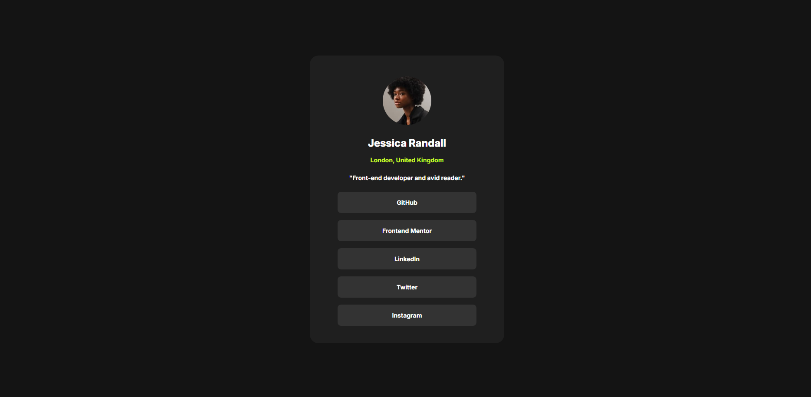

# Social Links Profile

This is a solution to the [Social links profile challenge on Frontend Mentor](https://www.frontendmentor.io/challenges/social-links-profile-UG32l9m6dQ). Frontend Mentor challenges help you improve your coding skills by building realistic projects.

## Table of Contents

- [Overview](#overview)
  - [The Challenge](#the-challenge)
  - [Screenshot](#screenshot)
  - [Links](#links)
- [My Process](#my-process)
  - [Built With](#built-with)
  - [What I Learned](#what-i-learned)
  - [Continued Development](#continued-development)
- [Author](#author)

## Overview

### The Challenge

Users should be able to:

- See hover and focus states for all interactive elements on the page

### Screenshot

<!-- Add a screenshot of your solution here -->


### Links

- Solution URL: https://github.com/ahmad7000mahadi/social-profile-links
- Live Site URL: https://ahmad7000mahadi.github.io/social-profile-links/

## My Process

### Built With

- Semantic HTML5 markup
- CSS Custom Properties (Variables)
- CSS Flexbox
- Modern CSS (Logical Properties, `clamp()`, `min()`)
- Mobile-first workflow

### What I Learned

This project was a deep dive into Modern CSS. I moved away from traditional fixed units and explicitly defined media queries, focusing instead on fluid design and logical properties.

Here are the key concepts I mastered during this build:

**1. Logical Properties vs. Physical Properties**

I learned to use `padding-block` and `padding-inline` instead of the traditional `padding-top/bottom` and `padding-left/right`. I realized this is crucial for internationalization—if the language direction changes (like LTR to RTL), these properties adapt automatically based on the text flow, whereas physical properties like `margin-left` would break the layout.

```css
body {
  /* Instead of padding-top: 1.5rem and padding-bottom: 1.5rem */
  padding-block: 1.5rem; 
  
  /* Instead of margin-left: auto and margin-right: auto */
  margin-inline: auto; 
}
````

**2. Fluid Widths with `min()`**

I discovered that I don't always need media queries to handle responsive card widths. By using the `min()` function, I can set a "Gas Pedal" (100%) and a "Brake" (28rem). The browser automatically selects the smaller value, making the card full-width on mobile but fixed-width on desktop.

```css
.card {
  /* No media query needed! */
  width: min(100%, 28rem);
}
```

**3. Fluid Typography with `clamp()`**

I learned how to make font sizes scale smoothly between screen sizes without using breakpoints. `clamp()` takes three values: a minimum floor, a preferred fluid rate (based on viewport width `vw`), and a maximum ceiling.

```css
.card-author-name {
  /* Minimum: 1.25rem, Preferred: 5% of Viewport, Maximum: 1.5rem */
  font-size: clamp(1.25rem, 5vw, 1.5rem);
}
```

### Continued Development

In future projects, I want to continue exploring logical properties, specifically how they interact with CSS Grid, and practice using `clamp()` for spacing (margins/padding) as well as font sizes.

## Author

  - Frontend Mentor - [@ahmad7000mahadi](https://www.frontendmentor.io/profile/ahmad7000mahadi)